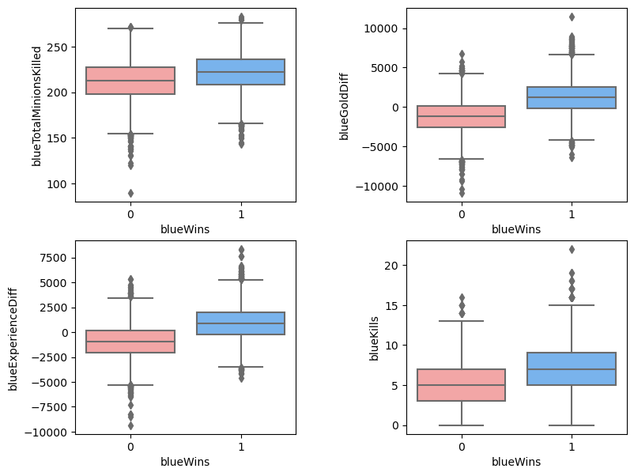

# League of legends Analysis & Prediction on the first 10 minutes metrics
This repository contains an in-depth analysis of League of Legends matches based on various game material and metric. The project includes data visualization, statistical analysis, and machine learning techniques to provide a prediction model for determining the winner of a match. 

    

## Dataset
[League of Legends Diamond Ranked Games (10 min)](https://www.kaggle.com/datasets/bobbyscience/league-of-legends-diamond-ranked-games-10-min)

League of Legends is a MOBA (multiplayer online battle arena) where 2 teams (blue and red) face off. There are 3 lanes, a jungle, and 5 roles. The goal is to take down the enemy Nexus to win the game.
Content

This dataset contains the first 10min. stats of approx. 10k ranked games (SOLO QUEUE) from a high ELO (DIAMOND I to MASTER). Players have roughly the same level.

Each game is unique. The gameId can help you to fetch more attributes from the Riot API.

There are 19 features per team (38 in total) collected after 10min in-game. This includes kills, deaths, gold, experience, level… It's up to you to do some feature engineering to get more insights.

The column blueWins is the target value (the value we are trying to predict). A value of 1 means the blue team has won. 0 otherwise.

So far I know, there is no missing value.
Glossary

## Correlation matrix

    

## Outliers scatter matrix

    

## Box plot on numerical variables

    

## Prediction models

| Classifier                          | Accuracy score | Precision score | Recall score | F1 score  |
|-------------------------------------|----------------|-----------------|--------------|-----------|
| Gradient Boosting Classifier        | 0.733382       | 0.733353        | 0.732711     | 0.733032  |
| Stacking Classifier                 | 0.732216       | 0.732320        | 0.731252     | 0.731786  |
| Logistic Regression                 | 0.731778       | 0.732630        | 0.729209     | 0.730915  |
| Support Vector Machine              | 0.728863       | 0.728492        | 0.728917     | 0.728705  |
| Multi-layer Perceptron Classifier   | 0.728134       | 0.727299        | 0.729209     | 0.728253  |

## Conclusion

**Gold, experience difference, KDA ratio and number of minions killed** are the metrics that exert the greatest influence to the outcome of a League of Legends match. The team having these metrics higher in the first 10 minutes is more likely to gain advantages and secure a victory.

**Gradient Boosting Classifier** is the prediction model with the **best performance**, as it demonstrates consistently superior evaluation scores (e.g. accuracy, precision, recall and f1 score). With the **accuracy of 0.733**, it can be a promising model to predict the result of a match base on the metrics obtained during the first 10 minutes of gameplay.